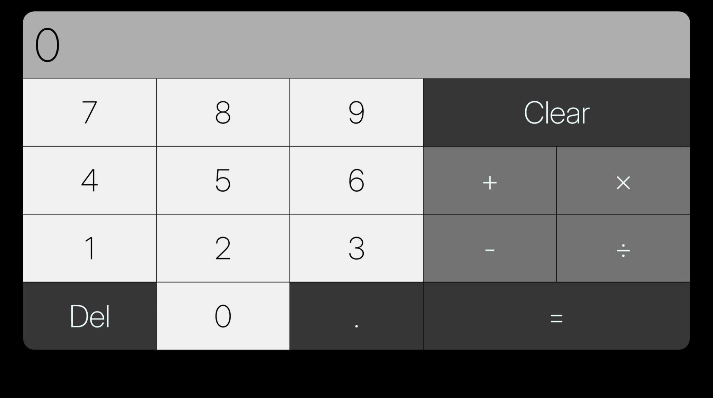
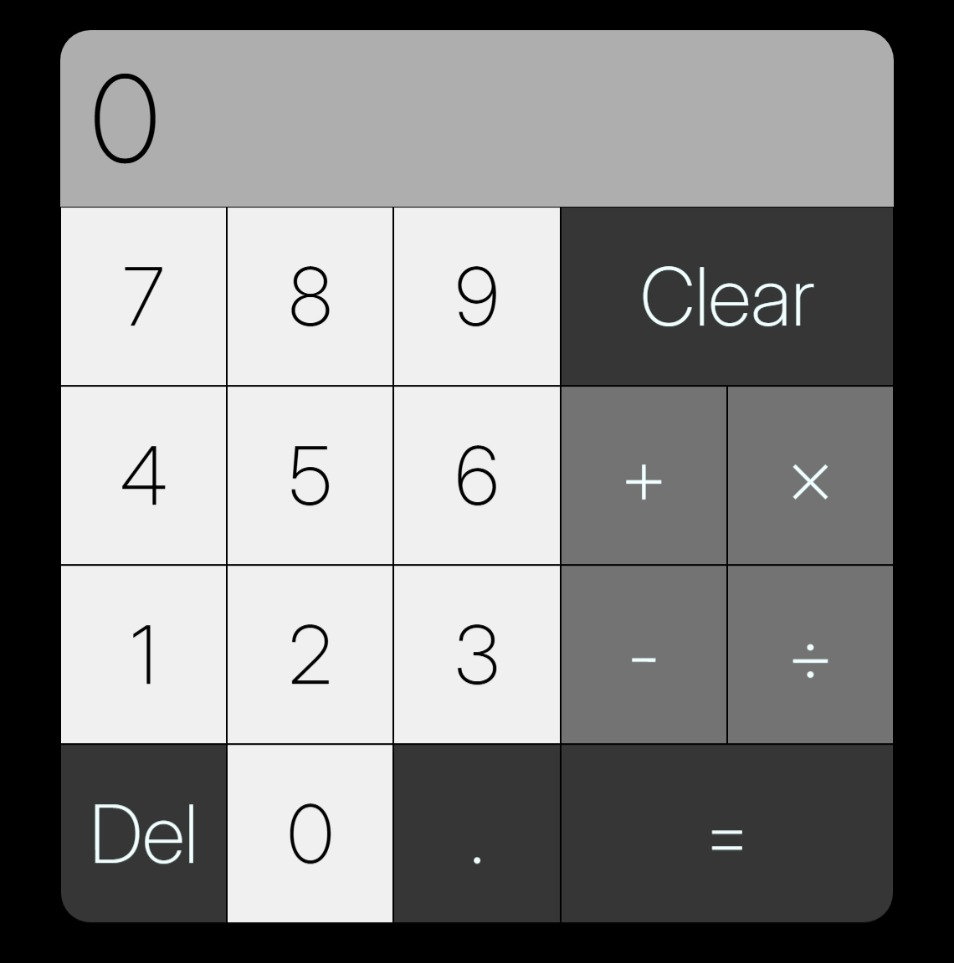

# calculator
Simple calculator project based on The Odin Project curriculum.

Live demo link: https://j0e-quan.github.io/calculator/

## Technologies used:
 - HTML for basic layout of page
 - CSS for styling calculator and use of web fonts (Inter)
 - Flexbox for arranging buttons and automatic resizing to fit mobile displays
 - JavaScript for calculation logic and button imput
 - Git for version control

## Key features:
 - Supports basic mathematical operations (addition, subtraction, multiplication and division)
 - Supports chained operations e.g. 4 + 1 * 3 / 5
 - Supports keyboard imput
 - Del key for deleting a single digit and Clear key for resetting calculator
 - UI resizes to fit mobile displays

## Gallery:

## Getting started:
1. clone this repo in your desired folder: `git clone https://github.com/J0e-Quan/calculator.git`
2. open index.html in your browser to run the code